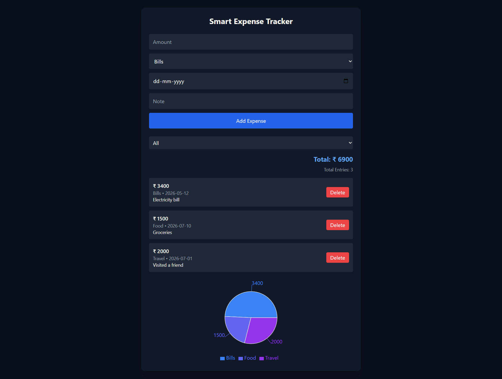

# 💰 Smart Expense Tracker

A responsive personal finance web application that helps users efficiently track and manage their daily expenses through an intuitive dashboard with real-time expense tracking, category filtering, data visualization, and persistent browser storage.

---

## 🚀 Live Demo

🌐 https://soft-haupia-f89210.netlify.app/

---

## 📸 Application Preview

### Dashboard



---

## ✨ Features

- Add new expense transactions
- Delete existing transactions
- Categorize expenses (Bills, Food, Travel, etc.)
- Filter expenses by category
- View total expenses and total number of entries
- Interactive pie chart for expense visualization
- Persistent data storage using Browser Local Storage
- Clean and responsive user interface

---

## 🛠️ Tech Stack

- HTML5
- CSS3
- JavaScript (ES6)
- Chart.js
- Browser Local Storage API
- Netlify

---

## 📚 Concepts Demonstrated

- CRUD Operations
- DOM Manipulation
- Event Handling
- Local Storage
- Dynamic Data Rendering
- Chart Integration using Chart.js
- Responsive Web Design
- JavaScript Array Methods

---

## 📂 Project Structure

```text
smart-expense-tracker/
│
├── index.html
├── style.css
├── script.js
├── dashboard.png
└── README.md
```

---

## 🚀 Future Enhancements

- Edit existing expense records
- User Authentication
- Cloud Database Integration
- Monthly Expense Analytics
- Budget Planner
- Export Reports (PDF / CSV)
- AI-powered Spending Insights
- Personalized Budget Recommendations

---

## 👩‍💻 Author

**Nandini Kasiraju**

📧 Email:  
mail.nandinikasiraju@gmail.com

💼 LinkedIn:  
https://www.linkedin.com/in/nandini-kasiraju-2650473a5

💻 GitHub:  
https://github.com/nandiniK7

---

## 📄 License

This project is created for educational and portfolio purposes.
